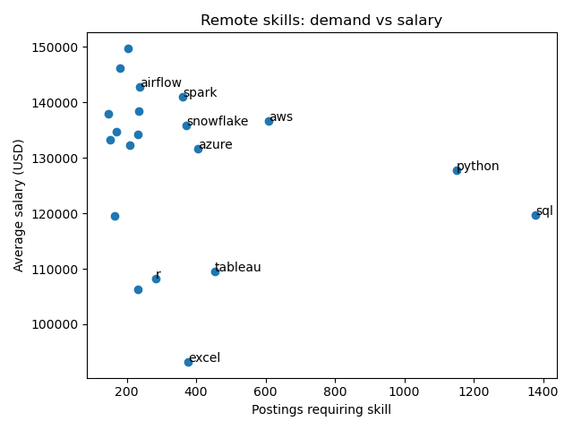

# Analyst & Engineering Jobs Market Analysis (2023)

Part of a broader SQL learning journey inspired by Luke Barousse’s SQL for Data Analytics, this project focuses on applying SQL to real-world job market data.  
It combines SQL querying with Python visualizations, executed fully in **VS Code** with PostgreSQL and Anaconda as the backend.

---

## Table of Contents
- [Objective](#objective)
- [Workflow](#workflow)
- [Entity Relationship Diagram (ERD)](#entity-relationship-diagram-erd)
- [Findings](#findings)
  - [1. Salary Distribution by Location](#1-salary-distribution-by-location)
  - [2. Role Mix (Analyst vs Engineer)](#2-role-mix-analyst-vs-engineer)
  - [3. Remote Skills — Demand vs Salary](#3-remote-skills--demand-vs-salary)
  - [4. Most Repeated Postings](#4-most-repeated-postings)
  - [5. Company Presence in Top-50](#5-company-presence-in-top-50)
  - [6. Top Paying Skills (US & Remote)](#6-top-paying-skills-us--remote)
  - [7. Skills Frequency in High-Pay Jobs](#7-skills-frequency-in-high-pay-jobs)
- [Insights & Recommendations](#insights--recommendations)
- [Technical Details](#technical-details)

---

## Objective
The goal of this project is to critically examine **Analyst** and **Engineering** job postings across **US, UK, Canada, and Remote** roles in 2023, focusing on:

- Top-paying roles and their distribution  
- Salary benchmarks across regions  
- The balance between **demand and compensation** for technical skills  
- Identifying repeated postings and potential data noise  
- Highlighting companies with consistent high-paying roles  

This analysis helps uncover not just *where the money is*, but also which skills and contexts sustain long-term demand.

---

## Workflow
- SQL schema created in PostgreSQL (`sql_load` folder).  
- Queries executed in VS Code using the SQLTools extension (`sql_queries` folder).  
- Output stored as CSV in `queried_csv` for visualization.  
- Visuals created with Python (Matplotlib/Seaborn) in the `visualizations` folder.  

---

## Entity Relationship Diagram (ERD)

The schema consists of four main tables:

- **company_dim** → company details (name, links, thumbnails)  
- **job_posting_facts** → job posting details (salary, job type, posting date, degree/insurance mentions, etc.)  
- **skills_job_dim** → mapping table between jobs and skills  
- **skills_dim** → skills and their type (technical, soft, etc.)

This structure enables flexible joins between companies, job postings, and required skills for richer analysis.

📊 **Why this schema works well for analysis:**
- **Fact Table (job_postings_fact):** Holds the key quantitative information — salaries, job type, dates, location.  
- **Dimension Tables (company_dim, skills_dim):** Store descriptive attributes (company details, skill categories).  
- **Bridge Table (skills_job_dim):** Implements a **many-to-many relationship** between jobs and skills, ensuring flexibility — a job can require multiple skills, and a skill can appear in many jobs.  
- **Scalability:** Easy to join and extend (e.g., adding new dimensions like industries, education requirements).  
- **Analytical Clarity:** The design cleanly separates *measures* (salary, postings) from *descriptions* (company, skill type), enabling powerful aggregations with simple SQL queries.  

**💡 Critical Insight:**  
<small>
This schema balances normalization (for data integrity) with a dimensional design (for analytical speed). 
It mirrors best practices in analytics databases, making it straightforward to query, filter, and visualize 
insights such as salary trends, skill demand, and location differences.
</small>
---

## Findings

### 1. Salary Distribution by Location

📊 **Key Findings**
- **US**: Median salary ~ **$249k**, max ~ **$375k**.  
- **Remote**: Median ~ **$236k**, max ~ **$650k** (driven by a single Analyst outlier).  
- **UK & Canada**: Absent in Top-50 highest salaries (filtered by this dataset).  

💡 **Insight**: US & Remote dominate the high-salary tier. UK/Canada representation is limited either due to dataset coverage or genuinely lower advertised salaries.

---

### 2. Role Mix (Analyst vs Engineer)

📊 **Key Findings**
- **47 Engineering vs 3 Analyst roles** in Top-50.  
- Median pay roughly similar (~$240k), but Analyst average inflated by one extreme posting.  

💡 **Insight**: Engineering positions remain the core of high-paying opportunities; although analyst roles can reach higher salaries, such cases are significantly less common.

---

### 3. Remote Skills — Demand vs Salary

📊 **Key Findings**
- **High-demand, moderate pay**: SQL (~1.3k postings, ~$120k), Python (~1.1k postings, ~$128k).  
- **Lower-demand, higher pay**: Spark, Airflow, Snowflake, AWS (~$135k–$145k, <400 postings).  

💡 **Insight**: Versatile skills offer job security, while niche platforms tend to favour specialists with higher salaries.

---

### 4. Most Repeated Postings

📊 **Key Findings**  
Aggregators such as Listopro tend to inflate posting counts through the use of templated advertisements. Additionally, popular postings do not necessarily represent unique opportunities.  

💡 **Insight**:  Treat posting counts as signals of demand rather than definitive indicators of job availability.

---

### 5. Top 10 Companies' Presence with Different Roles in the Top-50

📊 **Key Findings**
- Certain companies (e.g., Engtal, Harnham) appear multiple times in the Top-50.  
- Indicates active, high-budget hiring strategies.  

💡 **Insight**: Multiple appearances suggest firms scaling aggressively or filling specialist pipelines.

---

### 6. Top Paying Skills
  

📊 **Key Findings**
- **US:** Kubernetes (~$207k, 14 jobs), Jira (~$205k, 7 jobs). Some inflated one-off skills (Next.js, Django) appear due to **n=1 postings**.  
- **Remote:** Azure (~$132k), AWS (~$137k), Spark (~$141k), Airflow (~$143k).  

💡 **Insight**: Pair salary averages with **posting volume**; one-off postings may mislead.

---

### 7. Skills Frequency in High-Pay Jobs

📊 **Key Findings**
- **SQL, Python, AWS** dominate frequency in high-paying jobs.  
- Emerging tools appear sporadically but can signal future opportunities.  

💡 **Insight**: Foundational stack skills remain indispensable, even in the top-salary tier.

---

## Insights & Recommendations
- **Broaden skill filters** to include *scientist*, *architect*, and *manager* roles for a more comprehensive market overview.  
- **Standardise location labels** (UK vs United Kingdom, city-level tags) to enhance accuracy.  
- **Salary caution**: Outliers and single-posting averages can distort the true market medians.  
- **Career strategy**: Focus on **SQL + Python** while integrating **cloud (AWS/Azure)** and **workflow tools (Airflow, Spark)** for higher-paying specialist roles.

---

## Technical Details
- **Database**: PostgreSQL  
- **Code Editor**: VS Code (SQLTools extension and python)  
- **Visualization**: Python (Matplotlib)  
- **SQL Files**: See `/sql` folder (`top_paying_jobs.sql`, `job_posting_count.sql`, etc.)  
- **Data Sources**: Job postings fact tables with joins to companies and skills.  

---
